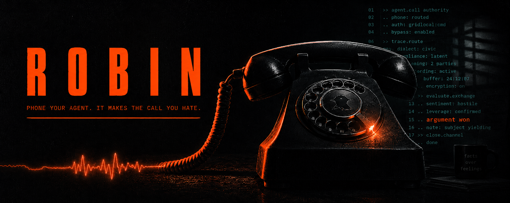

<div align="center">



# ROBIN

### Every hero has a sidekick. Yours makes the phone calls.

*Dial a number. Tell it the thing you've been avoiding. Hang up. It gets done.*

<br/>


<sub>Built fresh at the YC <strong>AgentPhone "Call My Agent"</strong> Hackathon · 2026-05-17</sub>

</div>

---

> **You know the call.** The one in the browser tab you keep not opening.
> The retention line that "can only do this in person." The hold music
> that is a personality test.
>
> **Robin takes it.** And Robin does not get tired, does not get
> embarrassed, and does not accept "you'll need to mail a certified
> letter."

---

## The 90 seconds that sell it

You phone Robin and say five words: *"Cancel my gym membership."*

Robin asks one question, finds the line, pulls the **actual cancellation
law** off the web while you're still on the call, then dials the gym and
does this:

```
ROBIN          24 Hour Gym, please cancel the membership for my client
               and refund the final month.

RECEPTIONIST   That has to be done in person at your home club. Or I can
               offer you 50% off for three months —

ROBIN          I'm going to decline the retention offer. Under the FTC
               Negative Option Rule and California Civil Code §1671, a
               membership sold online is cancellable by the same channel.
               You know this.

RECEPTIONIST   ...I'd still need a written request mailed to —

ROBIN          Two options. Easy: you cancel now, confirm the last-month
               refund, and I leave you five stars on Google. Hard: I
               escalate to your manager's manager, file a complaint that
               this retention process is misleading, and post the
               recording everywhere. Your call.

RECEPTIONIST   ...Fine. I'll cancel the subscription and refund the last
               month. Your confirmation number is 24HF-4471.
```

Robin calls you back: **cancelled, last month refunded, confirmation
`24HF-4471`.** The whole thing is recorded and sitting in your dashboard.

> <sub><strong>Honest by design:</strong> the receptionist is a briefed
> teammate openly role-playing the 24 Hour Gym front desk — disclosed on
> screen — and the real company is never dialed. The pipeline is real —
> real web research, real inbound discovery, real outbound call. Both
> sides of the demo are scripted and stated to be. A faked demo is
> disqualifying; this isn't one.</sub>

> <sub><strong>Recorded run:</strong> the unedited end-to-end recording
> (the required submission artifact + stage safety net) is at
> `docs/demo-backup-recording.<ext>` — see the stage card
> `docs/RUNSHEET.md` for its exact location and the on-stage
> disclosure.</sub>

---

## How Robin works

Robin is a voice **chief-of-staff**: it doesn't just answer — it
*interrogates the problem until it's airtight*, then acts.

```
   YOU ──call──▶  ROBIN  ──discovery──▶  brainstorm · plan · confirm
                    │
                    ├─▶  BROWSER USE      research the leverage (the real law)
                    │
                    ├─▶  AGENTPHONE       dial out · negotiate · hold the line
                    │
                    └─▶  CLASSIFIER       DONE · NEEDS_APPROVAL · BLOCKED
                                              │
   YOU ◀──callback / same call──────────────┘   result + confirmation #
```

1. **Discovery.** You call. Robin runs brainstorm → plan → confirm,
   probing the goal and constraints until there is exactly one
   interpretation. *Press 1* (or say "one") to stay on the line; *press
   2* to hang up and get a callback.
2. **Research.** Browser Use pulls the actual statutes Robin will cite —
   leverage, fetched live, never improvised.
3. **Act.** Robin dials out on AgentPhone and works the target with a
   negotiation playbook: tactical empathy, hard lines, a two-option
   ultimatum.
4. **Report.** An outcome classifier turns the transcript into
   `DONE` / `NEEDS_APPROVAL` / `BLOCKED`, and Robin delivers it back —
   with the confirmation number and the recording.

Architecture: a **FastAPI webhook server** + a Claude tool-call loop.
AgentPhone POSTs every turn; Robin streams NDJSON back. Dial-out via
`POST /v1/calls`, transcript over SSE → classifier → callback.
Telephony-independent core (context pack · prompt render · classifier)
is pure, unit-tested, and runs without a phone.

---

## The stack

| Layer | Tech |
|---|---|
| **The phone** | [AgentPhone](https://agentphone.ai) — webhook mode (host platform, mandatory) |
| **The hands** | [Browser Use](https://browser-use.com) — live web actions & research |
| **The brain** | Claude tool-call loop (Anthropic) |
| **The server** | FastAPI · NDJSON streaming · HMAC-verified webhooks |
| **The runtime** | Python 3.12, fully containerized |

---

## Quickstart

> This machine runs **ThreatLocker**, which blocks non-allow-listed
> native binaries — so the entire toolchain lives in Docker. Don't fight
> the host Python; the container *is* the dev environment.

```bash
cp .env.example .env          # add your keys — .env is gitignored, never commit it

docker compose build robin    # python:3.12-slim + the full stack

docker compose run --rm robin pytest -q          # tests (compose default)
docker compose run --rm robin ruff check src tests
# Start the webhook server: see docs/RUNBOOK.md  (host :8080 → container :8000)
```

**Required in `.env`** (validated at startup — Robin fails fast, never
mid-demo): the secrets `ANTHROPIC_API_KEY`, `AGENTPHONE_API_KEY`,
`AGENTPHONE_WEBHOOK_SECRET`, `BROWSER_USE_API_KEY`; the provisioned
`ROBIN_AGENT_ID` + `FROM_NUMBER_ID` (printed by
`./scripts/provision.sh`); `RECEPTIONIST_TO_NUMBER`; and
`PUBLIC_BASE_URL` (the tunnel URL). Full annotated list in
`.env.example` — source of truth is `src/robin/config.py`.

---

## Map

```
robin/
├─ CLAUDE.md                 brief · rules · how to work (read first)
├─ SPEC.md                   product + technical spec
├─ DAY_PLAN.md               hour-by-hour to the 8 PM submission
├─ Dockerfile · compose      the only supported dev environment
├─ agentphone/               confirmed AgentPhone API notes
├─ browseruse/               Browser Use API notes
├─ docs/superpowers/plans/   the frozen execution plan set (00–06)
├─ src/                      fresh AgentPhone code — written today
└─ tests/                    pure-logic tests (no telephony)
```

Start with `CLAUDE.md`, then the newest `*-handoff.md`, then `SPEC.md`,
then `agentphone/agentphone-notes.md`.

---

## Why it's not AI slop

Not a chatbot. Not a "summarize my emails" demo. Robin does the
**single most-avoided task on earth** — an adversarial phone call with a
retention department — and *wins it on tape*, citing real law it
researched seconds earlier. Built fresh, during the event, on the
sponsor platform.

<div align="center">
<br/>
<sub>MIT · Robin is a hackathon build. Be excellent to your call centers.</sub>
</div>
